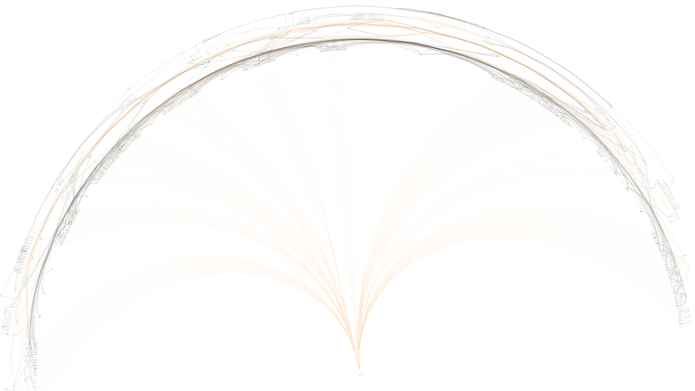
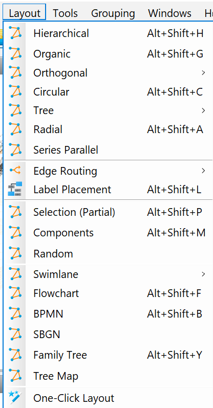

# Notion graph view

The script helps to create graph view based on information it retrieves from notion database.
It takes the data and converts it to graphml format, so it could be viewed in [yEd](https://www.yworks.com/products/yed) afterwards.

At the moment it is wirtten in the way, so it can only work with my databases, but you can use it as a refference to construct something that fits you.



### Prerequisites

- Python 3

### Installation

```bash 
virtualenv venv
venv\Scripts\activate
pip install -r requirements.txt
```

### Execution

- Add config.json to the root folder. The process of generating a token and collecting a database id is described [here](https://developers.notion.com/docs/getting-started)
```json
{
    "token": "token",
    "zet_database_id": "db_id",
    "tags_database_id": "db_id"
}
```
- Execute:
```bash
python main.py
```
- Once zettelkasten.graphml is created open it in [yEd](https://www.yworks.com/products/yed) and apply a layout of your choice



- Profit

### To Do
- [ ] Let to set path and name of final file
- [ ] Exe
